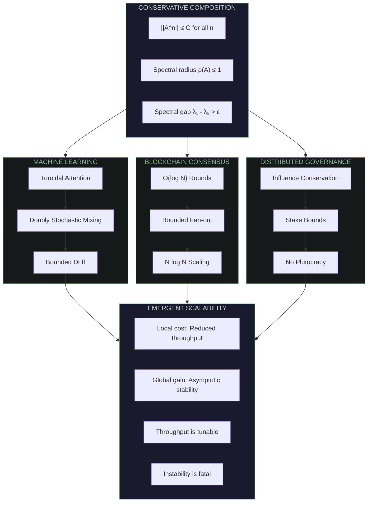
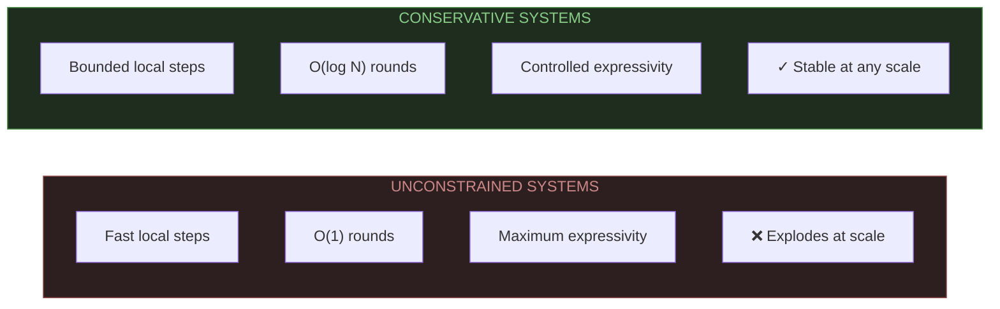
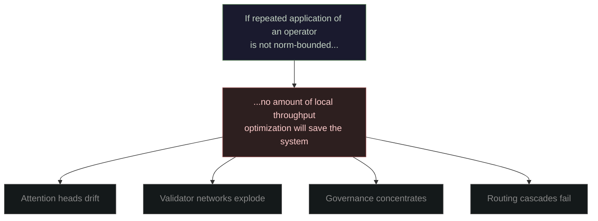

# Unified Operator Diagram

## The Same Math, Three Domains

```mermaid
flowchart TB
    subgraph PRINCIPLE["CONSERVATIVE COMPOSITION"]
        P1["||A^n|| ≤ C for all n"]
        P2["Spectral radius ρ(A) ≤ 1"]
        P3["Spectral gap λ₁ - λ₂ > ε"]
    end

    PRINCIPLE --> ML
    PRINCIPLE --> CONSENSUS
    PRINCIPLE --> GOVERNANCE

    subgraph ML["MACHINE LEARNING"]
        ML1["Toroidal Attention"]
        ML2["Doubly Stochastic Mixing"]
        ML3["Bounded Drift"]
        ML1 --> ML2 --> ML3
    end

    subgraph CONSENSUS["BLOCKCHAIN CONSENSUS"]
        C1["O(log N) Rounds"]
        C2["Bounded Fan-out"]
        C3["N log N Scaling"]
        C1 --> C2 --> C3
    end

    subgraph GOVERNANCE["DISTRIBUTED GOVERNANCE"]
        G1["Influence Conservation"]
        G2["Stake Bounds"]
        G3["No Plutocracy"]
        G1 --> G2 --> G3
    end

    ML3 --> RESULT
    C3 --> RESULT
    G3 --> RESULT

    subgraph RESULT["EMERGENT SCALABILITY"]
        R1["Local cost: Reduced throughput"]
        R2["Global gain: Asymptotic stability"]
        R3["Throughput is tunable"]
        R4["Instability is fatal"]
    end

    style PRINCIPLE fill:#1a1a2e,stroke:#588157,color:#c4d4c4
    style ML fill:#14191a,stroke:#588157,color:#8ab88a
    style CONSENSUS fill:#14191a,stroke:#588157,color:#8ab88a
    style GOVERNANCE fill:#14191a,stroke:#588157,color:#8ab88a
    style RESULT fill:#1a1a2e,stroke:#6a9a6a,color:#c4d4c4
```

## Comparison Table

```mermaid
graph LR
    subgraph UNCONSTRAINED["UNCONSTRAINED SYSTEMS"]
        U1["Fast local steps"]
        U2["O(1) rounds"]
        U3["Maximum expressivity"]
        U4["❌ Explodes at scale"]
    end

    subgraph CONSTRAINED["CONSERVATIVE SYSTEMS"]
        C1["Bounded local steps"]
        C2["O(log N) rounds"]
        C3["Controlled expressivity"]
        C4["✓ Stable at any scale"]
    end

    style UNCONSTRAINED fill:#2d1f1f,stroke:#8b4444,color:#cc8888
    style CONSTRAINED fill:#1f2d1f,stroke:#448b44,color:#88cc88
```

## The Punchline

```mermaid
graph TD
    A["If repeated application of an operator<br/>is not norm-bounded..."]
    B["...no amount of local throughput<br/>optimization will save the system"]

    A --> B

    B --> D1["Attention heads drift"]
    B --> D2["Validator networks explode"]
    B --> D3["Governance concentrates"]
    B --> D4["Routing cascades fail"]

    style A fill:#1a1a2e,stroke:#588157,color:#c4d4c4
    style B fill:#2d1f1f,stroke:#8b4444,color:#ffcccc
    style D1 fill:#14191a,stroke:#444,color:#888
    style D2 fill:#14191a,stroke:#444,color:#888
    style D3 fill:#14191a,stroke:#444,color:#888
    style D4 fill:#14191a,stroke:#444,color:#888
```
